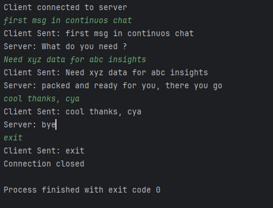
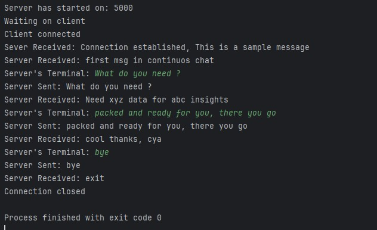
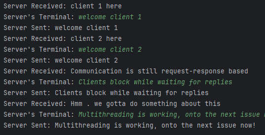
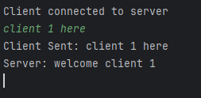
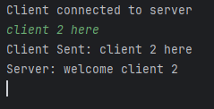
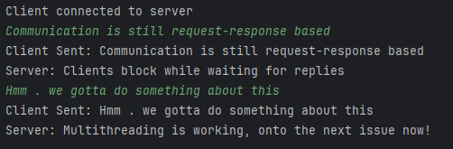

# Java Socket Programming

A hands-on project to learn low-level networking concepts in Java using TCP sockets.

This repository documents my journey of building socket-based client-server communication systems from scratch while understanding how networking works internally.

---

## Concepts Covered

- TCP Socket Communication
- ServerSocket vs Socket
- BufferedReader and PrintWriter
- Blocking I/O
- Persistent Connections
- Continuous Client-Server Communication
- Multi-threaded Client Handling

---

## Project Structure

```text
java-socket-programming/
│
├── src/
│   ├── level1_single_client_server/
│   ├── level2_echo_and_continuous_chat/
│   └── level3_multithreaded_server/
│
└── README.md
```

---

## Level 1 - Single Message Communication

### Features

- Basic TCP connection
- Single client and server
- One-time message transfer

### Concepts Learned

- TCP Handshake
- ServerSocket
- Socket
- Basic stream communication

---

## Level 2 - Continuous Chat

### Features

- Persistent TCP connection
- Continuous communication using loops
- Client and server exchange messages continuously

### Concepts Learned

- BufferedReader
- PrintWriter
- Stream buffering
- Blocking I/O

### Sample Output

#### Client



#### Server



---

## Level 3 - Multithreaded Server

### Features

- Multiple clients can connect simultaneously
- Each client handled on a separate thread
- Continuous communication maintained per client

### Concepts Learned

- Thread-per-client architecture
- Concurrent client handling
- Shared resource contention
- Blocking behavior in multithreaded systems

### Current Limitation

- Communication is still request-response based
- Clients wait for server replies before continuing
- Multiple threads currently share the same server terminal input (`System.in`)

### Sample Output

#### Multithreaded Client Handling

#### Server

#### Client 1

#### Client 2

#### Client 3



---

## Tech Stack

- Java
- TCP Sockets
- Java I/O Streams
- Multithreading
- IntelliJ IDEA
- Git & GitHub